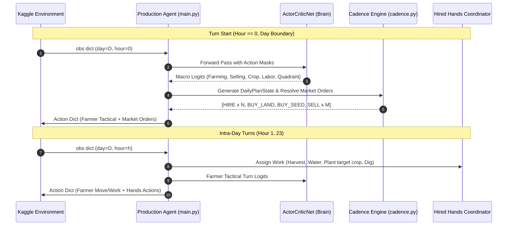

# Engineering Report: Daily Decision Cadence, Actor-Critic Rollout Cycle & Production Inference

## 1. Executive Summary

This report documents the architectural design, mathematical foundations, data structures, and production integration for:
1. **Daily Decision Cadence ([model/cadence.py](file:///c:/Applications%20and%20Development/Kaggriculture/model/cadence.py))**: Evaluates the farm board once per in-game day (every 24 turns at `hour == 0`) to establish macro objectives and dispatch day-start market orders (`HIRE`, `BUY_LAND`, `BUY_SEED`, `SELL`).
2. **Actor-Critic Rollout Cycle ([model/rollout.py](file:///c:/Applications%20and%20Development/Kaggriculture/model/rollout.py))**: Single-step stochastic sampling with action masking, joint log-probability tracking across factored heads, and vectorized GAE-$\lambda$ advantage/return calculation.
3. **Production Kaggle Inference Engine ([main.py](file:///c:/Applications%20and%20Development/Kaggriculture/main.py) & [model/agent.py](file:///c:/Applications%20and%20Development/Kaggriculture/model/agent.py))**: High-throughput, exception-resilient, pre-warmed competition submission agent.

---

## 2. The Two-Tier Decision Cadence

Kaggriculture features a 24-hour day cycle across 30 days (720 total turns). Making independent macro purchases every turn is computationally wasteful and creates erratic economic behavior. We adopt a **Hierarchical Two-Tier Cadence**:

### 2.1. Macro Decisions at Hour 0
At `hour == 0`, `evaluate_daily_plan()` runs `ActorCriticNet` to populate `DailyPlanState`:
- **`farming_strategy`**: `SUSTAIN`, `EXPAND_CROPS`, `EXPAND_LIVESTOCK`, `HARVEST_ALL`, `HOARD_RESOURCES`, `IDLE`.
- **`selling_strategy`**: `HOLD`, `DRIP_FEED_TOWN`, `MARKET_DUMP`, `SELL_EXCESS`, `EMERGENCY_CASH`.
- **`target_crop`**: `WHEAT`, `CARROT`, `TOMATO`, `STRAWBERRY`, `MELON`.
- **`hires_count`**: Number of farm hands to hire for the day ($0..5$).
- **`target_quadrant`**: Target land quadrant to unlock (`NW`, `NE`, `SW`, `SE`).

### 2.2. Day-Start Market Orders Dispatch
`resolve_daily_market_orders()` queues up to 10 market orders:
1. **Labor Hires**: Dispatches `["HIRE"]` $N$ times subject to cash availability according to the Fibonacci schedule:
   $$\text{Cost}(n) = \text{fib}(n) \implies [1, 1, 2, 3, 5, 8]$$
2. **Land Expansion**: If `target_quadrant` is locked and cash covers cost ($1k, $2k, $4k), dispatches `["BUY_LAND"]`.
3. **Seed Procurement**: If `EXPAND_CROPS`, calculates empty tile count and purchases up to budget.
4. **Produce Selling Posture**:
   - `DRIP_FEED_TOWN`: Sells produce up to the town's active shop consumption rate.
   - `MARKET_DUMP`: Liquidates entire shed produce stock on the open market.
   - `SELL_EXCESS`: Preserves safety reserves (10 wheat for animals, 5 fertilizer) and sells remainder.
   - `EMERGENCY_CASH`: Liquidates highest-priced goods if money falls below threshold.

---

## 3. Intra-Day Work Coordination (Hour 1..23)

During turns $1..23$, the farmer and hired hands execute synchronized tasks:
1. **Farmer Actions**:
   - Samples turn-level tactical logits (`PASS`, cardinal movement, `WATER`, `HARVEST`, `FEED`, `CARE`).
   - Auto-drop: when farmer stands on center shed tiles `(4,4), (5,4), (4,5), (5,5)` carrying crops or produce, automatically issues `["DROP"]` to empty field inventory into storage.
2. **Hired Hands Coordination**:
   - Hired hands autonomously prioritize:
     1. `HARVEST` mature crops (`yield_units > 0`).
     2. `WATER` unwatered plants (`not watered_today`).
     3. `PLANT` target crop seeds from the daily plan.
     4. `DIG` weeds.
     5. Move towards unexplored quadrants.

---

## 4. The Actor-Critic Rollout Cycle

### 4.1. Factored Stochastic Sampling & Joint Log-Probability
For training, actions must be stochastically sampled while tracking exact log-probabilities across all factored heads:
$$\log \pi_\theta(\mathbf{a} \mid \mathbf{s}) = \sum_{h \in \text{Heads}} \log \pi_\theta^{(h)}(a^{(h)} \mid \mathbf{s})$$
Where:
$$\log \pi_\theta^{(h)}(a \mid \mathbf{s}) = \hat{z}_a^{(h)} - \log \sum_j \exp(\hat{z}_j^{(h)})$$
`sample_factored_action()` applies $-10^9$ logit masks prior to softmax, guaranteeing that invalid actions have zero sampling probability.

### 4.2. Vectorized Generalized Advantage Estimation (GAE-$\lambda$)
Rollout trajectories evaluate TD errors and recursive advantages in JAX via `jax.lax.scan`:
$$\delta_t = r_t + \gamma V(s_{t+1})(1 - d_t) - V(s_t)$$
$$\hat{A}_t = \delta_t + \gamma \lambda (1 - d_t) \hat{A}_{t+1}$$
$$\hat{R}_t = \hat{A}_t + V(s_t)$$

---

## 5. Production Kaggle Entrypoint (`main.py`)

1. **Root File Compliance**: `main.py` is the designated entrypoint for `kaggle competitions submit kaggriculture -f main.py`.
2. **JIT Warmup**: On module import, `init_agent()` runs a forward pass with dummy tensors to trigger JAX JIT tracing immediately, ensuring step 0 completes in milliseconds without incurring timeout penalties.
3. **Resilient Exception Handling**: `agent(obs)` wraps all neural network and encoder routines in a robust `try...except` block, guaranteeing graceful fallback to a valid turn action rather than forfeiture on unexpected edge cases.
