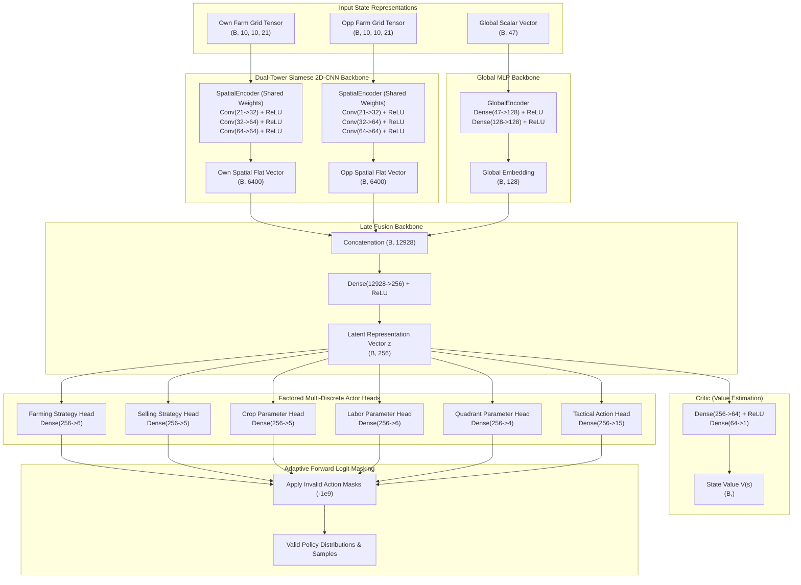

# Model Architecture Report: Dual-Tower Siamese 2D-CNN + Global MLP Late Fusion Network (`ActorCriticNet`)

## 1. Executive Summary

This report documents the architectural design, mathematical foundations, tensor dimensions, and implementation of **"The Actual Model In Between"** (`ActorCriticNet`) for the **Kaggriculture** multi-agent farming simulation.

Built natively in modern **JAX** and **Flax NNX** (`flax.nnx`), the network consumes the spatial feature tensors and scalar vectors generated by the observation encoder, extracts shared spatial symmetry via a **Dual-Tower Siamese 2D-CNN**, fuses global market and demand statistics, and outputs a **Factored Multi-Discrete Action Space** alongside a **Critic State-Value Baseline** $V(s)$.

---

## 2. Architecture Overview & Data Flow

---

## 3. Detailed Layer Specifications & Tensor Shapes

| Layer / Sub-module | Input Dimensions | Operations / Kernel | Output Dimensions | Parameter Count |
| :--- | :--- | :--- | :--- | :--- |
| **Spatial Conv 1** | $(B, 10, 10, 21)$ | $3 \times 3 \text{ Conv}, 32 \text{ filters, SAME}, \text{ReLU}$ | $(B, 10, 10, 32)$ | $21 \times (3 \times 3) \times 32 + 32 = 6,080$ |
| **Spatial Conv 2** | $(B, 10, 10, 32)$ | $3 \times 3 \text{ Conv}, 64 \text{ filters, SAME}, \text{ReLU}$ | $(B, 10, 10, 64)$ | $32 \times (3 \times 3) \times 64 + 64 = 18,496$ |
| **Spatial Conv 3** | $(B, 10, 10, 64)$ | $3 \times 3 \text{ Conv}, 64 \text{ filters, SAME}, \text{ReLU}$ | $(B, 10, 10, 64)$ | $64 \times (3 \times 3) \times 64 + 64 = 36,928$ |
| **Spatial Flatten** | $(B, 10, 10, 64)$ | $\text{Reshape}$ | $(B, 6400)$ | $0$ (Shared across Own & Opp) |
| **Global Dense 1** | $(B, 47)$ | $\text{Dense}(47 \to 128), \text{ReLU}$ | $(B, 128)$ | $47 \times 128 + 128 = 6,144$ |
| **Global Dense 2** | $(B, 128)$ | $\text{Dense}(128 \to 128), \text{ReLU}$ | $(B, 128)$ | $128 \times 128 + 128 = 16,512$ |
| **Late Fusion Dense** | $(B, 12928)$ | $\text{Dense}(12928 \to 256), \text{ReLU}$ | $(B, 256)$ | $12,928 \times 256 + 256 = 3,309,824$ |
| **Farming Strategy Head** | $(B, 256)$ | $\text{Dense}(256 \to 6)$ | $(B, 6)$ | $256 \times 6 + 6 = 1,542$ |
| **Selling Strategy Head** | $(B, 256)$ | $\text{Dense}(256 \to 5)$ | $(B, 5)$ | $256 \times 5 + 5 = 1,285$ |
| **Crop Parameter Head** | $(B, 256)$ | $\text{Dense}(256 \to 5)$ | $(B, 5)$ | $256 \times 5 + 5 = 1,285$ |
| **Labor Parameter Head** | $(B, 256)$ | $\text{Dense}(256 \to 6)$ | $(B, 6)$ | $256 \times 6 + 6 = 1,542$ |
| **Quadrant Parameter Head** | $(B, 256)$ | $\text{Dense}(256 \to 4)$ | $(B, 4)$ | $256 \times 4 + 4 = 1,028$ |
| **Tactical Action Head** | $(B, 256)$ | $\text{Dense}(256 \to 15)$ | $(B, 15)$ | $256 \times 15 + 15 = 3,855$ |
| **Critic Dense 1** | $(B, 256)$ | $\text{Dense}(256 \to 64), \text{ReLU}$ | $(B, 64)$ | $256 \times 64 + 64 = 16,448$ |
| **Critic Value Output** | $(B, 64)$ | $\text{Dense}(64 \to 1)$ | $(B, 1)$ | $64 \times 1 + 1 = 65$ |
| **Total Model Parameters** | — | — | — | **~3,413,200 params (~13.6 MB)** |

---

## 4. Factored Multi-Discrete Action Space (The Brain)

Instead of a monolithic combinatorial action space ($6 \times 5 \times 5 \times 6 \times 4 \times 15 = 54,000$ flat classes), the policy network decomposes the decision into **6 independent, factored discrete heads** branching from the latent vector $\mathbf{z} \in \mathbb{R}^{256}$:

### 4.1. Factored Action Head Specifications

| Head Name | Dim ($K$) | Output Type | Primary Role & Operational Meaning |
| :--- | :--- | :--- | :--- |
| **`farming`** | 6 | `FarmingStrategy` | Sets macro farming objective: `SUSTAIN (0)`, `EXPAND_CROPS (1)`, `EXPAND_LIVESTOCK (2)`, `HARVEST_ALL (3)`, `HOARD_RESOURCES (4)`, `IDLE (5)`. |
| **`selling`** | 5 | `SellingStrategy` | Controls dynamic market selling posture: `HOLD (0)`, `DRIP_FEED_TOWN (1)`, `MARKET_DUMP (2)`, `SELL_EXCESS (3)`, `EMERGENCY_CASH (4)`. |
| **`crop`** | 5 | `CropParam` | Argument for planting/buying: `WHEAT (0)` ($10), `CARROT (1)` ($20), `TOMATO (2)` ($30), `STRAWBERRY (3)` ($40), `MELON (4)` ($50). |
| **`labor`** | 6 | `LaborParam` | Target number of daily hired hands: `HIRE_0 (0)` to `HIRE_5 (5)` evaluated against Fibonacci cost curve $[1, 1, 2, 3, 5, 8]$. |
| **`quadrant`** | 4 | `QuadrantParam` | Target quadrant for land acquisition: `NW (0)` ($0), `NE (1)` ($1k), `SW (2)` ($2k), `SE (3)` ($4k). |9
| **`tactical`** | 15 | `TacticalAction` | Micro turn-level farmer primitives: `PASS (0)`, `NORTH (1)`, `SOUTH (2)`, `EAST (3)`, `WEST (4)`, `WATER (5)`, `HARVEST (6)`, `FERTILIZE (7)`, `FEED (8)`, `CARE (9)`, `COLLECT_FERTILIZER (10)`, `DIG (11)`, `PLANT_WHEAT (12)`, `PLANT_CARROT (13)`, `BUILD_COOP (14)`. |

---

### 4.2. 1-Turn Synthesis into Abstraction Level 1 Action Scripts

Every environment step $t$, the sampled decisions from these 6 heads are synthesized directly into legal [Abstraction Level 1 Action Scripts](file:///c:/Applications%20and%20Development/Kaggriculture/scripts/abs_level_1/):

1. **Labor Dispatch**: If `labor > 0`, queues `queue_hire()` market orders matching the target count.
2. **Land Acquisition**: If `quadrant > 0` and unbought, queues `queue_buy_land()`.
3. **Market Posture**: Evaluates `selling`:
   - `MARKET_DUMP`: Calls `queue_sell(crop, count)` for all shed items.
   - `DRIP_FEED_TOWN`: Sells only amounts consumed by active town shops (`townShopSellInterval`).
4. **Farming Operations**:
   - `EXPAND_CROPS`: Queues `queue_buy_seed(chosen_crop, n)` and executes `plant_tile(chosen_crop)` on the nearest empty tile.
   - `SUSTAIN` / `HARVEST_ALL`: Calls `water_tile()`, `harvest_tile()`, `feed_animal()`, or `drop_to_shed()`.
5. **Farmer Navigation**: `tactical` cardinal decisions call `step_farmer_cardinal("NORTH" | "SOUTH" | "EAST" | "WEST")`.

---

## 5. Adaptive Masking Mechanics

### 5.1. Forward Pass Logit Masking (`compute_action_masks`)
State-dependent boolean masks $M \in \{0, 1\}^K$ are computed in $O(1)$ from the observation:
$$\hat{z}_k = \begin{cases} z_k & \text{if } M_k = 1 \\ -10^9 & \text{if } M_k = 0 \end{cases}$$

**Rule-Specific Masking Logic:**
- **Seed & Maturity Validation**: Crop $c$ is masked out if $30 - \text{day} < \text{maturity}(c)$ (preventing planting crops that cannot mature before season end) or if $\text{money} < \text{cost}(c)$.
- **Shed Capacity Validation**: `HARVEST_ALL` is masked if $\text{shed\_count} \ge 100$.
- **Selling Validation**: Market sell strategies are masked if shed is empty ($\sum \text{items} = 0$).
- **Labor & Land Validation**: Hires/Land purchases are masked if current bank balance is less than cumulative cost.
- **Contextual Tactical Validation**: `WATER`/`HARVEST`/`FERTILIZE` are masked unless standing on a valid plant tile; `FEED`/`CARE`/`COLLECT` are masked unless on a coop/pasture.

### 5.2. Backward Pass Active-Head Gradient Masking
When an argument head is inactive (e.g., `crop` head during `SUSTAIN` strategy), an active-head binary indicator weight $w_h \in \{0.0, 1.0\}$ blocks noisy gradient propagation:
$$\mathcal{L}_{\text{total}} = \sum_{h \in \text{Heads}} w_h \cdot \mathcal{L}_{\text{CE}}(\hat{\mathbf{z}}^{(h)}, \mathbf{y}^{(h)})$$
When $w_h = 0.0$, $\frac{\partial \mathcal{L}}{\partial \theta_h} = \mathbf{0}$, isolating parameter heads from cross-task interference.

---

## 6. Verification and Integration

The complete neural architecture, action space, and Level 1 scripts are verified across automated test suites:
1. **[tests/test_network.py](file:///c:/Applications%20and%20Development/Kaggriculture/tests/test_network.py)**: Forward shape verification, $-10^9$ logit masking, Optax AdamW gradient flow, and live simulation steps.
2. **[tests/test_curriculum.py](file:///c:/Applications%20and%20Development/Kaggriculture/tests/test_curriculum.py)**: End-to-end integration covering $\Delta\text{NW}$ reward tracking, Phase 1 Behavioral Cloning, Phase 2 Ghost-Play PPO, and Phase 3 Self-Play League.
