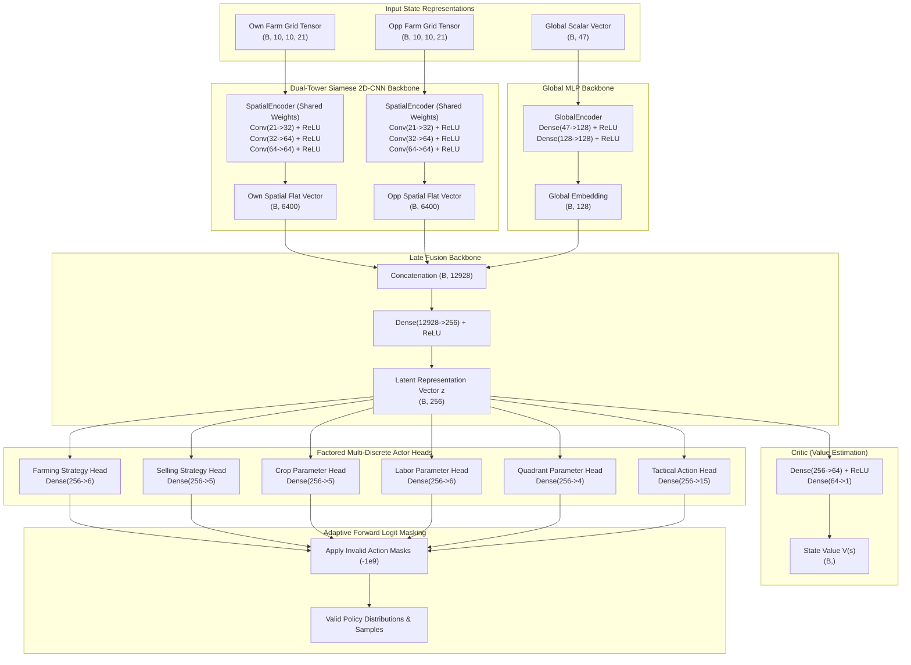

# Model Architecture Report: Dual-Tower Siamese 2D-CNN + Global MLP Late Fusion Network (`ActorCriticNet`)

## 1. Executive Summary

This report documents the architectural design, mathematical foundations, tensor dimensions, and implementation of **"The Actual Model In Between"** (`ActorCriticNet`) for the **Kaggriculture** multi-agent farming simulation.

Built natively in modern **JAX** and **Flax NNX** (`flax.nnx`), the network consumes the spatial feature tensors and scalar vectors generated by the observation encoder, extracts shared spatial symmetry via a **Dual-Tower Siamese 2D-CNN**, fuses global market and demand statistics, and outputs a **Factored Multi-Discrete Action Space** alongside a **Critic State-Value Baseline** $V(s)$.

---

## 2. Architecture Overview & Data Flow

---

## 3. Detailed Layer Specifications & Tensor Shapes

| Layer / Sub-module | Input Dimensions | Operations / Kernel | Output Dimensions | Parameter Count |
| :--- | :--- | :--- | :--- | :--- |
| **Spatial Conv 1** | $(B, 10, 10, 21)$ | $3 \times 3 \text{ Conv}, 32 \text{ filters, SAME}, \text{ReLU}$ | $(B, 10, 10, 32)$ | $21 \times (3 \times 3) \times 32 + 32 = 6,080$ |
| **Spatial Conv 2** | $(B, 10, 10, 32)$ | $3 \times 3 \text{ Conv}, 64 \text{ filters, SAME}, \text{ReLU}$ | $(B, 10, 10, 64)$ | $32 \times (3 \times 3) \times 64 + 64 = 18,496$ |
| **Spatial Conv 3** | $(B, 10, 10, 64)$ | $3 \times 3 \text{ Conv}, 64 \text{ filters, SAME}, \text{ReLU}$ | $(B, 10, 10, 64)$ | $64 \times (3 \times 3) \times 64 + 64 = 36,928$ |
| **Spatial Flatten** | $(B, 10, 10, 64)$ | $\text{Reshape}$ | $(B, 6400)$ | $0$ (Shared across Own & Opp) |
| **Global Dense 1** | $(B, 47)$ | $\text{Dense}(47 \to 128), \text{ReLU}$ | $(B, 128)$ | $47 \times 128 + 128 = 6,144$ |
| **Global Dense 2** | $(B, 128)$ | $\text{Dense}(128 \to 128), \text{ReLU}$ | $(B, 128)$ | $128 \times 128 + 128 = 16,512$ |
| **Late Fusion Dense** | $(B, 12928)$ | $\text{Dense}(12928 \to 256), \text{ReLU}$ | $(B, 256)$ | $12,928 \times 256 + 256 = 3,309,824$ |
| **Farming Strategy Head** | $(B, 256)$ | $\text{Dense}(256 \to 6)$ | $(B, 6)$ | $256 \times 6 + 6 = 1,542$ |
| **Selling Strategy Head** | $(B, 256)$ | $\text{Dense}(256 \to 5)$ | $(B, 5)$ | $256 \times 5 + 5 = 1,285$ |
| **Crop Parameter Head** | $(B, 256)$ | $\text{Dense}(256 \to 5)$ | $(B, 5)$ | $256 \times 5 + 5 = 1,285$ |
| **Labor Parameter Head** | $(B, 256)$ | $\text{Dense}(256 \to 6)$ | $(B, 6)$ | $256 \times 6 + 6 = 1,542$ |
| **Quadrant Parameter Head** | $(B, 256)$ | $\text{Dense}(256 \to 4)$ | $(B, 4)$ | $256 \times 4 + 4 = 1,028$ |
| **Tactical Action Head** | $(B, 256)$ | $\text{Dense}(256 \to 15)$ | $(B, 15)$ | $256 \times 15 + 15 = 3,855$ |
| **Critic Dense 1** | $(B, 256)$ | $\text{Dense}(256 \to 64), \text{ReLU}$ | $(B, 64)$ | $256 \times 64 + 64 = 16,448$ |
| **Critic Value Output** | $(B, 64)$ | $\text{Dense}(64 \to 1)$ | $(B, 1)$ | $64 \times 1 + 1 = 65$ |
| **Total Model Parameters** | — | — | — | **~3,413,200 params (~13.6 MB)** |

---

## 4. Factored Multi-Discrete Action Space (The Brain)

Instead of a combinatorial action space ($6 \times 5 \times 5 \times 6 \times 4 = 3,600$ flat classes), the policy branches into independent discrete heads:

### 4.1. Head Definitions
1. **Farming Strategy Head** ($K=6$):
   - `SUSTAIN (0)`: Maintain existing crops/animals (daily watering, feeding, fertilizing, care).
   - `EXPAND_CROPS (1)`: Purchase target seeds and expand crop coverage into empty tiles.
   - `EXPAND_LIVESTOCK (2)`: Construct coop/pasture and purchase livestock.
   - `HARVEST_ALL (3)`: Prioritize harvesting mature crops and transferring produce into the shed.
   - `HOARD_RESOURCES (4)`: Stockpile harvested goods without immediate market sale.
   - `IDLE (5)`: Conserve coins and pass optional activities.
2. **Selling Strategy Head** ($K=5$):
   - `HOLD (0)`: Hold shed inventory for future demand spikes or price increases.
   - `DRIP_FEED_TOWN (1)`: Sell exact quantities consumed by active unlocked town shops.
   - `MARKET_DUMP (2)`: Sell full shed inventory to the open dynamic market.
   - `SELL_EXCESS (3)`: Sell stock exceeding safety reserves (e.g., maintain wheat for livestock).
   - `EMERGENCY_CASH (4)`: Liquidate high-value assets to prevent bankruptcy or fund land purchase.
3. **Crop Parameter Head** ($K=5$): `WHEAT (0)`, `CARROT (1)`, `TOMATO (2)`, `STRAWBERRY (3)`, `MELON (4)`.
4. **Labor Parameter Head** ($K=6$): `HIRE_0 (0)` to `HIRE_5 (5)` daily hires based on the Fibonacci cost schedule.
5. **Quadrant Parameter Head** ($K=4$): `NW (0)`, `NE (1)`, `SW (2)`, `SE (3)`.
6. **Tactical Action Head** ($K=15$): Turn-level low-level actions (`PASS`, cardinal moves, tile actions).

---

## 5. Adaptive Masking Mechanics

### 5.1. Forward Pass Logit Masking
To prevent illegal action selection during rollout and inference, state-dependent boolean masks $M \in \{0, 1\}^K$ are computed in $O(1)$ from the observation. Invalid logits are suppressed via:
$$\hat{z}_k = \begin{cases} z_k & \text{if } M_k = 1 \\ -10^9 & \text{if } M_k = 0 \end{cases}$$
Post-softmax, $P(\text{invalid}) = \frac{\exp(-10^9)}{\sum_j \exp(\hat{z}_j)} \equiv 0.0$.

### 5.2. Backward Pass Active-Head Gradient Masking
When an argument head is inactive (for example, `Crop Parameter` is meaningless when `Farming Strategy` is `EXPAND_LIVESTOCK`), backpropagating cross-entropy loss would introduce noise into the head's weights. 

We apply an active-head binary indicator weight $w_h \in \{0.0, 1.0\}$:
$$\mathcal{L}_{\text{total}} = \sum_{h \in \text{Heads}} w_h \cdot \mathcal{L}_{\text{CE}}(\hat{\mathbf{z}}^{(h)}, \mathbf{y}^{(h)})$$
When $w_h = 0.0$, $\frac{\partial \mathcal{L}}{\partial \theta_h} = \mathbf{0}$, isolating parameter heads from cross-task interference.

---

## 6. Verification and Integration

The architecture was verified across four test suites in [tests/test_network.py](file:///c:/Applications%20and%20Development/Kaggriculture/tests/test_network.py):
1. **Tensor Shape Verification**: Validated forward pass across $(B, 10, 10, 21)$, $(B, 10, 10, 21)$, and $(B, 47)$ returning all 6 head logits and $V(s) \in \mathbb{R}^B$.
2. **Logit Masking Verification**: Verified that masked logits receive strictly 0.0 probability post-softmax.
3. **Optax Training Step & Gradient Masking**: Executed an end-to-end forward/backward step with `optax.adamw` demonstrating clean gradient flow and loss minimization.
4. **Kaggle Environment Agent Test**: Executed live `kaggle-environments` simulation turns verifying that the agent operates without exception.
