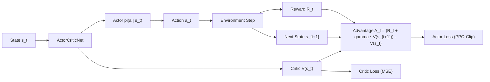
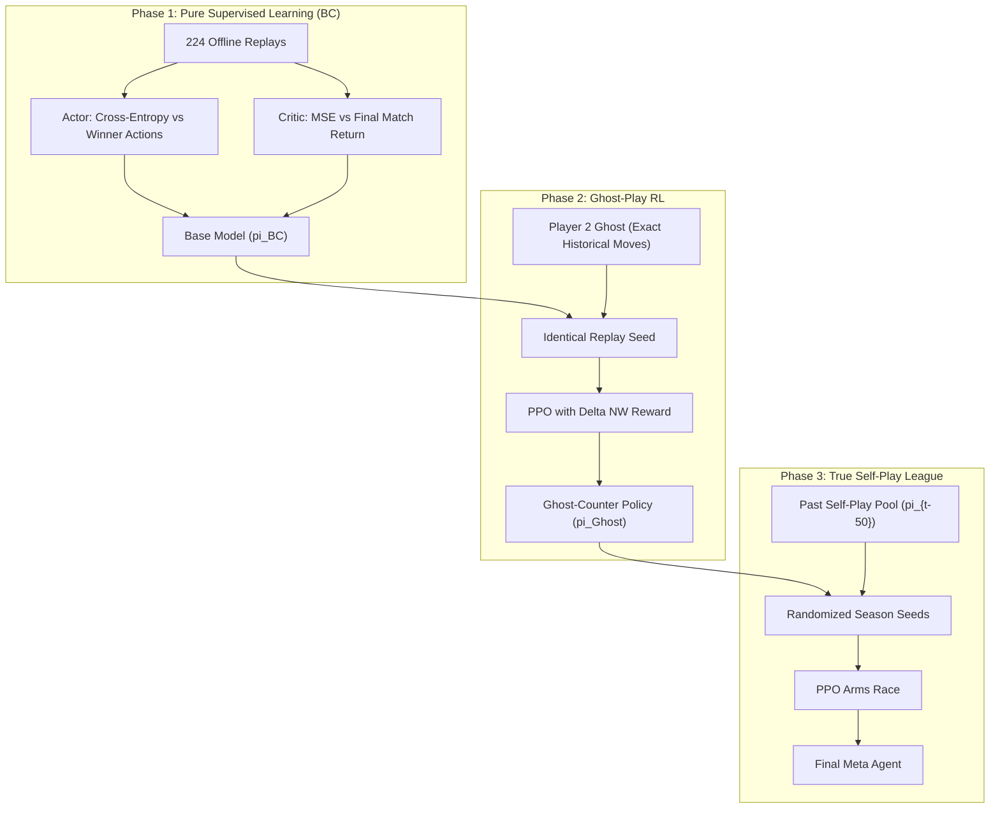

# Technical Report: 3-Phase Training Curriculum & Delta Net Worth ($\Delta\text{NW}$) Reward Engine

## 1. Executive Summary

This report establishes the complete theoretical foundations, mathematical formulations, and engineering architecture for:
1. **The Delta Net Worth ($\Delta\text{NW}$) Reward Engine**: Solves the 720-step credit assignment and market-loop hacking problems via potential-based economic asset valuation.
2. **Phase 1: Pure Supervised Learning (Behavioral Cloning)**: Offline pre-training on 224 Grandmaster replays without running the game engine.
3. **Phase 2: Ghost-Play Reinforcement Learning**: Online PPO optimization against fixed-trajectory ghost opponents playing historical winning matches on identical random seeds.
4. **Phase 3: True Self-Play PPO League**: Evolutionary arms race against historical frozen snapshot pools to discover novel meta-strategies.

---

## 2. Part 1: The Delta Net Worth ($\Delta\text{NW}$) Reward Structure

Traditional sparse rewards (giving $+1$ for a win at turn 720, $0$ elsewhere) fail on complex 720-step economic simulations because the gradient signal is too distant from early actions (like planting on turn 1).

### 2.1. Net Worth Formula
At every turn $t$, the total monetary value of the player's farm is calculated as:
$$NW_t = \text{Cash}_t + \text{ShedValue}_t + \text{FieldValue}_t + \text{SeedValue}_t$$

Where:
- **$\text{Cash}_t$**: Liquid coins in the bank (`farms[player]["money"]`).
- **$\text{ShedValue}_t$**: $\sum_{i} \text{Count}_i \times P_t(i)$ (Current market liquidation value of all harvested produce, animal products, and fertilizer in storage).
- **$\text{FieldValue}_t$**: Expected future yield value of living crops discounted by remaining maturity time:
  $$\text{FieldValue}_t = \sum_{\text{plants}} \left( \text{BaseYield} + \text{BonusYield} \right) \times P_t(\text{crop}) \times \left( \frac{\text{Age}}{\text{MaxYieldAge}} \right)$$
- **$\text{SeedValue}_t$**: $\sum_{c} \text{Seeds}_c \times \text{SeedPrice}(c)$ (Unplanted seed reserves at purchase cost).

### 2.2. The Step Reward ($R_t$)
$$R_t = (NW_t - NW_{t-1}) - \lambda$$

- **Economic Neutrality**: Buying a seed transfers Cash into SeedValue ($NW$ delta is $0$, so reward is neutral).
- **Productive Incentives**: Watering crops increases their yield potential ($NW$ increases, $R_t > 0$).
- **Living Penalty ($\lambda = 0.05$)**: Prevents passive idle loops by enforcing an urgency to generate economic return.

---

## 3. Part 2: Actor-Critic & PPO Loss Mechanics

### 3.1. Advantage Feedback Loop ($A_t$)
$$A_t = (R_t + \gamma V(s_{t+1})) - V(s_t)$$
- **$A_t > 0$**: The chosen action yielded higher value than expected $\implies$ increase action probability $\pi(a_t \mid s_t)$.
- **$A_t < 0$**: The chosen action underperformed the baseline $\implies$ decrease action probability.

### 3.2. Total Loss Equation
$$L(\theta, \phi) = L_{\text{Actor}}(\theta) - c_1 L_{\text{Critic}}(\phi) + c_2 S_{\text{Entropy}}(\theta)$$
- **$L_{\text{Actor}}$ (Clipped Surrogate Objective)**: Prevents destructive policy updates by bounding probability ratios within $[1-\epsilon, 1+\epsilon]$.
- **$L_{\text{Critic}}$ (Value Loss)**: Minimizes $(V_\phi(s_t) - \hat{R}_t)^2$.
- **$S_{\text{Entropy}}$**: Maintains exploration across unmasked action branches.

---

## 4. Part 3: The 3-Phase Training Progression

| Phase | Opponent Type | Seed Setup | Reward Engine | Objective |
| :--- | :--- | :--- | :--- | :--- |
| **Phase 1: Supervised BC** | None (Static Classification) | N/A | Cross-Entropy + Value MSE | Learn rules, planting rhythms, and basic economics in minutes. |
| **Phase 2: Ghost-Play RL** | Historical Pro (Ghost script replay) | Exact Replay Seeds | $\Delta\text{NW}$ Step Reward | Learn to react, counter-attack, and out-time proven competitive lines. |
| **Phase 3: Self-Play PPO** | Past Self Snapshots ($\pi_{t-50}$) | Randomized Seeds | $\Delta\text{NW}$ + Sparse Win Bonus | Continuous meta-discovery exceeding historical gameplay ceilings. |
